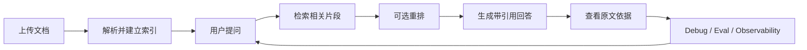

# CiteRAG：面向科研/工程资料的可引用 RAG 问答助手

CiteRAG 是一个面向科研与工程项目资料管理的**可引用知识问答产品原型**。它针对实验室科研资料、项目文档和方案说明分散、人工检索成本高、纯大模型回答缺乏依据的问题，提供从**文档上传 → 解析建索引 → 检索问答 → 引用溯源 → Debug 调试 → Eval 评测 → 可观测复盘**的完整闭环。

> 项目定位：一个强调**可信回答、证据不足拒答、策略评测和可观测迭代**的 RAG 产品原型。

---

## 1. 项目来源

在实验室科研和工程项目真实场景中，用户在查找资料或使用大模型辅助问答时，主要会遇到以下问题：

- **找资料慢**：科研/项目资料散落在多个文档中，人工逐个打开、搜索和比对成本高，尤其当用户只记得大概问题、不记得具体文件位置时，查找效率更低。
- **资料相关性弱**：直接使用关键词搜索或让大模型基于有限上下文回答时，容易返回泛泛相关、局部相关或与问题不完全匹配的内容，用户仍需要二次筛选真正有用的资料片段。
- **答案不可信**：纯大模型回答缺少明确依据，用户不知道答案来自哪个文件、哪一段原文，也不知道回答中的哪句话可信、哪句话可能是模型推测。
- **错误难定位**：当回答答非所问或遗漏关键信息时，很难判断问题出在检索未命中、召回片段相关性不足、引用不足，还是生成阶段偏题。

因此，CiteRAG 的核心目标是：

- 让答案**可追溯**：每次回答都返回 citations，支持查看原文依据。
- 让风险**可控制**：证据不足时主动 no-answer/refusal，降低幻觉风险。
- 让问题**可定位**：通过 `/ask_debug`、eval、metrics、tracing 和结构化日志定位“慢、贵、不准”的问题。

---

## 2. 核心能力

| 能力 | 说明 |
|---|---|
| 多格式文档解析 | 支持 `.txt / .md / .html / .pdf / .docx` 5 类文档上传与解析 |
| 文档管理 | 支持文件列表、分组、重命名、软删除、索引状态查看 |
| 检索策略 | 支持 `bm25 / vector / hybrid` 3 种检索模式 |
| 重排策略 | 支持 `none / cohere` 2 种 rerank 配置，默认不强启外部 rerank |
| 双阶段召回 | 默认 `retrieve_top_k=10 → top_k=3`，先召回候选片段，再保留最终进入生成器的片段 |
| 带引用回答 | 答案返回 citations，包括原文件名、原文件id、chunk_id等 |
| 证据不足拒答 | 通过 no-answer/refusal 机制避免模型无依据回答 |
| Debug 调试 | `/ask_debug` 返回 hits、citations、question_type、effective_retrieve_top_k 等字段 |
| 本地评测 | 构建 8 条 eval case，覆盖 keyword、semantic、confusion、no_answer 4 类场景 |
| 可观测性 | 接入 Prometheus metrics、OpenTelemetry tracing 与结构化日志 |

---

## 3. 产品流程



典型使用链路：

1. 上传文档，可选择 `auto_index=true` 自动索引。
2. 系统解析文档并构建 BM25/向量索引。
3. 用户提问，可指定文件范围、检索模式、重排模式和召回参数。
4. 系统检索相关 chunk，并基于证据生成回答。
5. 回答返回 citations，用户可回看原文依据。
6. 如果回答不理想，可通过 `/ask_debug` 查看命中块与引用块。
7. 通过本地 eval 和可观测性数据复盘失败 case，迭代检索、Prompt、chunk 和 rerank 策略。

---

## 4. 评测结果与产品取舍

项目设定本地评测集，用于对比不同检索/重排策略，而不是凭感觉决定默认策略。

当前评测集包含 8 条 case，覆盖 4 类场景：

| 场景 | 目的 | 结果 |
|---|---|---:|
| keyword | 验证关键词精确命中 | 12/12 |
| semantic | 验证语义概括能力 | 11/12 |
| confusion | 验证上下文混淆处理 | 12/12 |
| no_answer | 验证证据不足拒答 | 12/12 |

策略评测覆盖：

- 3 种检索模式：`bm25 / vector / hybrid`
- 2 种重排模式：`none / cohere`
- 8 条本地 eval case
- 共 48 组策略组合评测
- 整体通过：**47/48**

### 产品取舍

评测发现：

- `none` rerank 在当前评测集中 **24/24** 通过，稳定性最好。
- `cohere` rerank 在一个总结型 semantic case 中出现 **1 次 quality_failure**。
- 该失败 case 的表现是：答案描述成“文件上传和检索系统”，但没有命中预期的 `RAG / 检索增强生成` 核心概念。

因此当前版本选择：

- 默认检索策略：`hybrid`
- 默认重排策略：`none`
- `cohere` rerank 保留为可选能力，而不是默认强启

这个取舍体现了项目的产品原则：**AI 功能不是越多越好，策略必须通过评测验证后再默认启用。**

---

## 5. 可观测性设计

为了定位“慢、贵、不准、没有引用、答非所问、该拒答时没拒答”的问题，CiteRAG 接入了三层可观测性。

| 工具 |  解决的问题  | 项目中的作用 |
|---|---|---|
| Prometheus-style metrics |  看整体趋势  | 统计请求数、上传/索引/问答耗时、命中数、引用数 |
| OpenTelemetry tracing |  看单次链路  | 拆解 retrieval、rerank、generation 等阶段耗时 |
| 结构化日志 |  看单次细节  | 记录 question、retrieval_mode、top_k、hits_count、citations_count、tokens、estimated_cost_usd |

已暴露的自定义指标包括：

- `citerag_requests_total`
- `citerag_request_latency_seconds`
- `citerag_upload_requests_total`
- `citerag_upload_latency_seconds`
- `citerag_index_requests_total`
- `citerag_index_latency_seconds`
- `citerag_ask_requests_total`
- `citerag_ask_latency_seconds`
- `citerag_retrieval_hits_count`
- `citerag_citations_count`

一次真实 `/ask_debug` 样例中，系统可记录：

- retrieval mode：`hybrid`
- `retrieve_top_k=10`，`top_k=3`
- hits_count：3
- citations_count：3
- retrieval_ms / rerank_ms / generation_ms
- prompt_tokens / completion_tokens / total_tokens
- estimated_cost_usd

这使系统能够把“慢、贵、不准”拆解成可定位的问题：是检索慢、生成慢、引用不足、Token 成本偏高，还是检索策略不适配。

---

## 6. API Overview

启动服务后可访问 Swagger：

```text
http://127.0.0.1:8000/docs
```

### Health

- `GET /health`
- `POST /echo`

### Files & Groups

- `POST /upload`
- `GET /files`
- `GET /groups`
- `POST /groups`
- `PATCH /files/{file_id}/rename`
- `PATCH /files/{file_id}/group`
- `DELETE /files/{file_id}`

### Index

- `POST /index/{file_id}`
- `POST /index_all`

### QA

- `POST /ask`
- `POST /ask_debug`

### Observability

- `GET /metrics`

---

## 7. Architecture

```text
app/
├─ main.py
├─ schemas.py
├─ dependencies.py
├─ routers/
│  ├─ health.py
│  ├─ upload.py
│  ├─ index.py
│  └─ qa.py
├─ services/
│  ├─ file_service.py
│  ├─ index_service.py
│  ├─ retrieval_service.py
│  └─ qa_service.py
├─ providers/
│  ├─ llm_provider.py
│  ├─ embedding_provider.py
│  └─ rerank_provider.py
├─ repositories/
│  ├─ file_repository.py
│  ├─ index_repository.py
│  ├─ vector_repository.py
│  └─ sqlite_repository.py
├─ parsers/
│  ├─ base_parser.py
│  ├─ text_parser.py
│  ├─ html_parser.py
│  ├─ pdf_parser.py
│  ├─ docx_parser.py
│  └─ parser_factory.py
└─ core/
   ├─ observability.py
   ├─ tracing.py
   └─ exceptions.py
```

---

## 8. 本地运行

### 8.1 安装依赖

```bash
python3 -m venv .venv
source .venv/bin/activate
python -m pip install --upgrade pip
python -m pip install -e ".[dev]"
```

### 8.2 配置环境变量

在项目根目录创建 `.env`：

```env
GENERATOR_MODE=fake
AIHUBMIX_API_KEY=your_key_here
AI_MODEL=gpt-4o-mini
AI_BASE_URL=https://aihubmix.com/v1
EMBEDDING_MODEL=text-embedding-3-small
COHERE_API_KEY=your_cohere_key_here
```

说明：

- `GENERATOR_MODE=fake`：本地测试模式，不依赖真实模型生成。
- `GENERATOR_MODE=real`：启用真实模型。
- `COHERE_API_KEY`：仅在使用 `rerank_mode=cohere` 时需要。

### 8.3 启动服务

```bash
uvicorn app.main:app --reload
```

启动后访问：

```text
http://127.0.0.1:8000/docs
http://127.0.0.1:8000/metrics
```

---

## 9. Minimal Demo Flow

1. 上传文档并自动索引：

```bash
curl -X POST "http://127.0.0.1:8000/upload?auto_index=true" \
  -F "file=@README.md"
```

2. 使用 `/ask_debug` 调试问答链路：

```bash
curl -X POST "http://127.0.0.1:8000/ask_debug" \
  -H "Content-Type: application/json" \
  -d '{
    "question": "README 里有哪些 retrieval modes？",
    "file_id": "YOUR_FILE_ID",
    "retrieval_mode": "hybrid",
    "rerank_mode": "none",
    "top_k": 3,
    "retrieve_top_k": 10
  }'
```

3. 查看 Prometheus-style metrics：

```bash
curl http://127.0.0.1:8000/metrics
```

4. 运行本地评测：

```bash
make eval
```

---

## 10. Current Limitations

- 当前 eval set 是原型阶段的最小可用评测集，不代表大规模真实场景准确率。
- 检索质量依赖源文档质量、chunk 策略和问题表达。
- real generator 目前仍依赖 Prompt 约束，结构化输出和 retry policy 可进一步增强。
- reranking 是任务相关能力，不适合在所有场景默认强启。
- `/metrics` 和 tracing 已具备本地可观测能力，但生产级 dashboard 尚未接入。

---

## 11. Roadmap

- 扩充真实科研资料问答测试集，增加人工标注样本。
- 引入 context precision、faithfulness、answer relevance 等更细粒度评测指标。
- 优化 question-type routing，细分 definition / process / compare / why 等问题类型。
- 强化 no-answer/refusal 策略，降低低证据场景下的幻觉风险。
- 增强 `/ask_debug` 诊断信息，输出更清晰的检索失败类型。


---

## 12. 产品复盘：从 RAG 到可评测的 AI 产品原型

该项目围绕科研/工程资料问答场景，完成从问题定义、产品流程设计、可信回答机制、策略评测到可观测迭代的完整闭环：

- **问题定义**：从科研/项目资料分散、人工检索成本高、资料相关性弱、纯大模型回答缺少依据等问题出发，明确产品目标不是“让模型回答更多问题”，而是“让用户更快找到可信依据”。
- **产品设计**：围绕“上传文档—解析建索引—检索问答—引用回看—证据不足拒答—Debug 调试”的核心链路，设计可引用、可回溯、可定位的 RAG 问答体验。
- **AI 能力边界**：将 RAG 定位为基于外部资料的辅助问答工具，而非万能知识库；当检索证据不足时，系统应主动 no-answer/refusal，避免强行生成无依据答案。
- **评测意识**：通过 eval case、策略组合对比和 failure summary 验证检索、重排和拒答机制。
- **产品取舍**：基于本地评测结果发现 none rerank 在当前评测集中更稳定，因此没有默认强启 cohere rerank，而是将其保留为任务相关的可选能力。
- **可观测迭代**：通过 metrics、tracing 和结构化日志拆解“慢、贵、不准”问题，支持从请求量、耗时、命中数、引用数、Token 成本和单次链路细节等角度持续优化。
